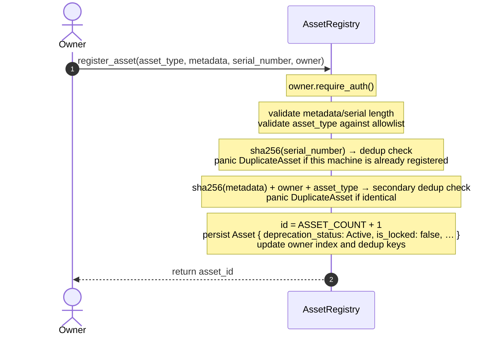
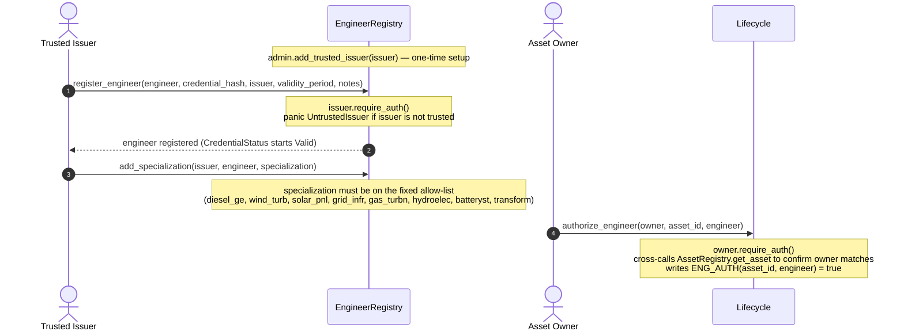
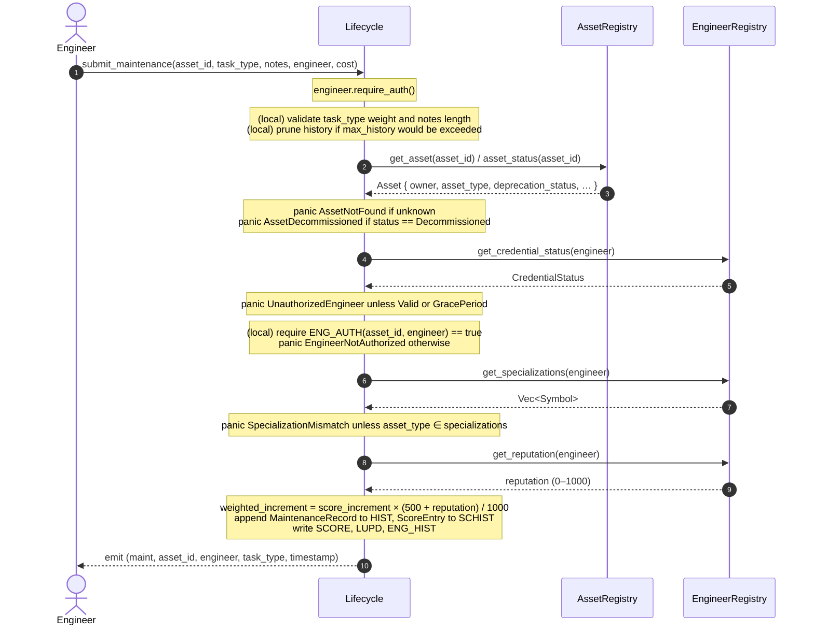
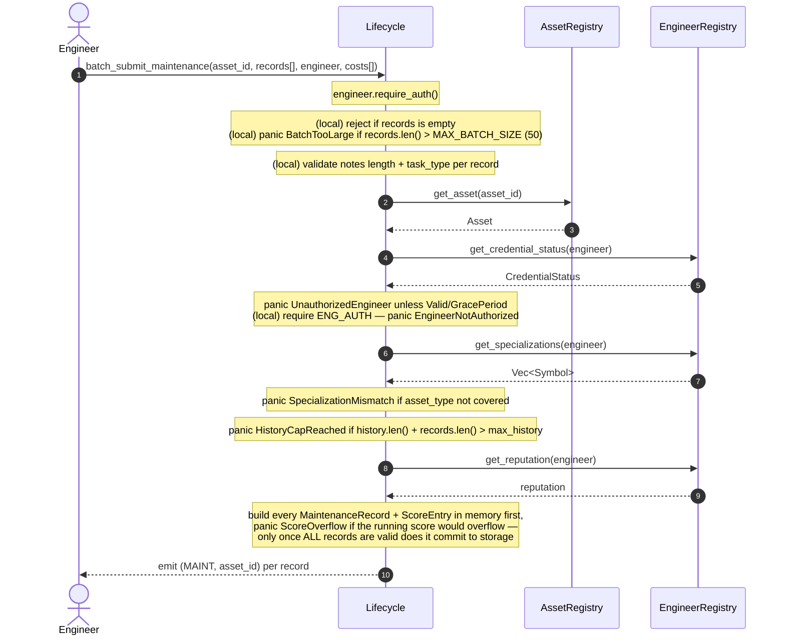
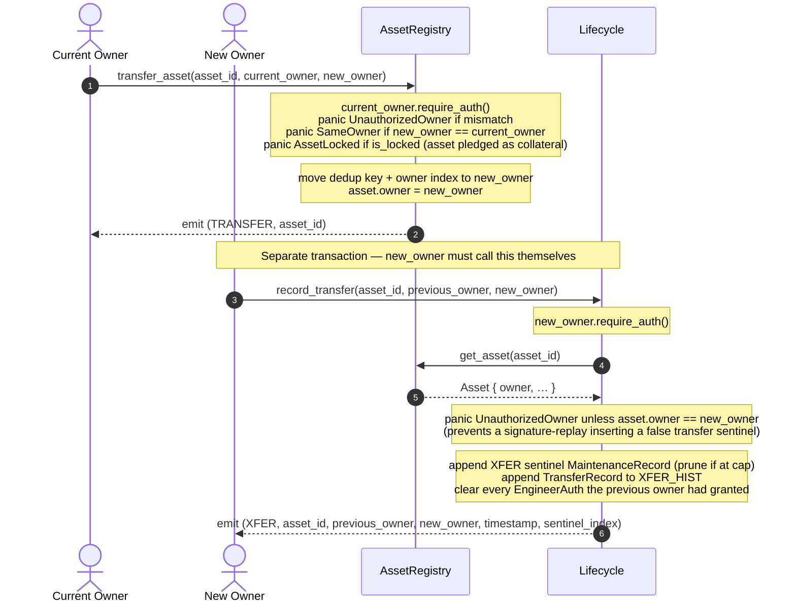
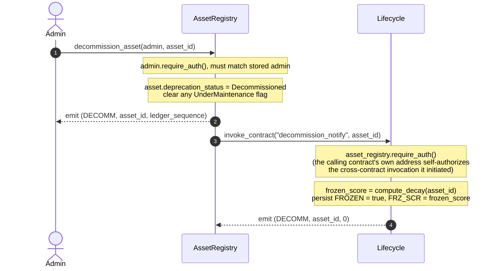
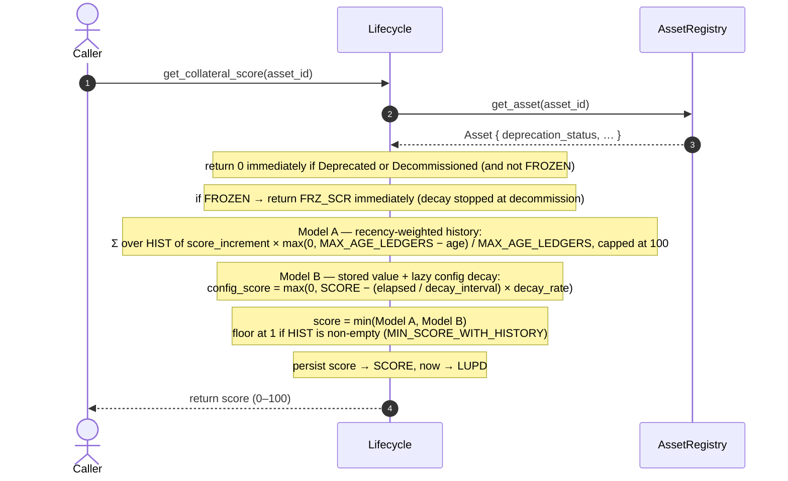
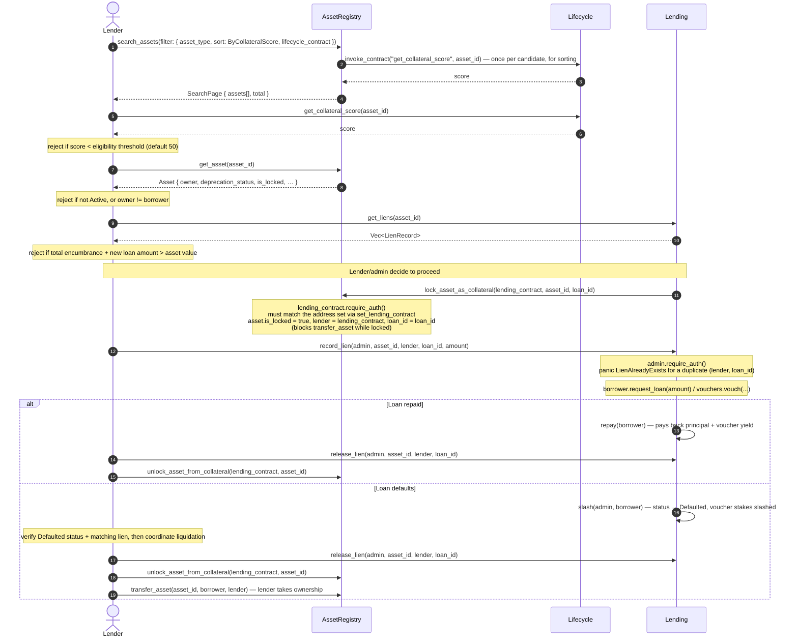
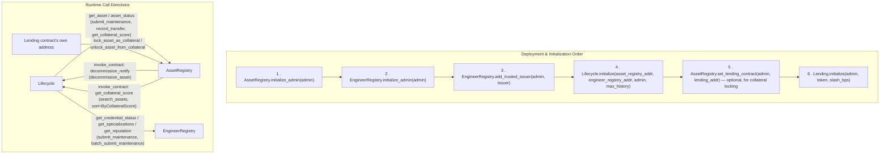

# Contract Interaction Sequence Diagrams

Detailed sequence and timing diagrams for the flows that span more than one
Mainstay contract. This document complements [architecture.md](architecture.md)
(contract responsibilities and storage) and
[lender-integration-guide.md](lender-integration-guide.md) (integration-facing
API reference) by focusing specifically on **who calls whom, in what order,
and what can go wrong along the way**.

---

## Table of Contents

1. [Contract Map](#contract-map)
2. [Asset Registration](#asset-registration)
3. [Engineer Credentialing](#engineer-credentialing)
4. [Maintenance Submission](#maintenance-submission)
5. [Batch Maintenance Submission](#batch-maintenance-submission)
6. [Ownership Transfer](#ownership-transfer)
7. [Decommissioning](#decommissioning)
8. [Collateral Score Query](#collateral-score-query)
9. [Collateral Usage (Lending Flow)](#collateral-usage-lending-flow)
10. [Error Scenario Reference](#error-scenario-reference)
11. [Contract Call Dependency Graph](#contract-call-dependency-graph)
12. [Timing Diagrams](#timing-diagrams)

---

## Contract Map

| Contract | Owns | Called by |
|---|---|---|
| `AssetRegistry` | Asset records, ownership, dedup, search, collateral locks | `Lifecycle` (read-only queries), the registered `lending_contract` address (`lock_asset_as_collateral` / `unlock_asset_from_collateral`), asset owners directly |
| `EngineerRegistry` | Engineer credentials, trusted issuers, reputation | `Lifecycle` (read-only queries), issuers/engineers directly |
| `Lifecycle` | Maintenance history, collateral score, decay | `AssetRegistry` (via `decommission_notify`, invoked automatically), engineers/owners directly |
| `Lending` | Loans, vouching, liens, slashing | Borrowers/vouchers/admin directly; not cross-called by the other three |

`Lifecycle` is the primary orchestrator — it is the only contract that reads
from *both* `AssetRegistry` and `EngineerRegistry` in the same call. The
reverse direction also exists: `AssetRegistry.search_assets` cross-calls into
`Lifecycle.get_collateral_score` when sorting by `ByCollateralScore`, and
`AssetRegistry.decommission_asset` cross-calls `Lifecycle.decommission_notify`.
`Lending` is intentionally decoupled — it never calls the other three
contracts on-chain; an operator/admin bridges the two systems (see
[Collateral Usage](#collateral-usage-lending-flow)).

---

## Asset Registration



**Preconditions:** contract initialized (`initialize_admin`), `asset_type`
previously allow-listed via `add_asset_type`, contract not paused.

**Notes:**
- Deduplication is two-layered: the **serial number** hash prevents the same
  physical machine from ever being registered twice (by anyone), while the
  **owner + metadata** hash prevents one owner from double-registering the
  same description.
- A newly registered asset always starts `Active`, unlocked, with no lender.

---

## Engineer Credentialing

Maintenance submission depends on a valid engineer credential, so the
credentialing flow is a hard prerequisite for [Maintenance
Submission](#maintenance-submission).



**Notes:**
- `authorize_engineer` is asset-scoped and separate from the credential
  itself: an engineer can hold a valid credential and still be rejected from
  submitting for a *specific* asset until its owner explicitly authorizes them.
- `CredentialStatus` has 7 states (`Valid`, `GracePeriod`, `HardExpired`,
  `Revoked`, `NotFound`, `Suspended`, `Expired`); `submit_maintenance` only
  accepts `Valid` or `GracePeriod`.
- Revoking an owner's authorization goes through a timelock
  (`propose_revoke_engineer_auth` → `execute_revoke_engineer_auth`) to give an
  engineer a grace period to finish in-progress work — see [Timing
  Diagrams](#timing-diagrams).

---

## Maintenance Submission

The full `submit_maintenance` sequence. Local, gas-free validation always runs
before any cross-contract call, so the transaction fails cheaply on obviously
invalid input.



**Cross-contract calls made:** up to 4 (`get_asset`/`asset_status`,
`get_credential_status`, `get_specializations`, `get_reputation`) — all
read-only queries against the other two contracts; `Lifecycle` is the only
contract that writes as a result of this flow.

---

## Batch Maintenance Submission

`batch_submit_maintenance` validates and scores the *entire* batch before
writing anything, so a failure partway through never leaves partial state.



**Why validate-then-commit matters:** because the whole batch is one Soroban
transaction, a `panic!` anywhere aborts and reverts all storage writes anyway
— but building every record up front (rather than writing as you go) keeps
the code's invariants explicit and avoids ever having a half-written batch
*in memory* to reason about, independent of the ledger's own atomicity.

---

## Ownership Transfer

Ownership transfer is a **two-step, two-contract** flow — `AssetRegistry`
moves ownership, then the new owner separately tells `Lifecycle` about it so
the maintenance history gets an `XFER` boundary marker. These are two
independent transactions; nothing forces the second to happen immediately
after the first.



**Why the second step matters:** all `EngineerAuth` grants from the previous
owner are revoked as part of `record_transfer`. Until the new owner calls it,
the *previous* owner's authorized engineers can still submit maintenance
records — this is a known integration gotcha worth flagging to new owners.

There is also a **multi-signature variant**
(`initiate_ownership_transfer` → `accept_ownership_transfer`, a 7-day
proposal window) for cases where the current and new owner want to coordinate
the handoff instead of a single unilateral `transfer_asset` call.

---

## Decommissioning

Unlike transfer, decommissioning **is** wired up as an automatic
cross-contract call — the admin only ever calls `AssetRegistry`.



**Notes:**
- `AssetRegistry` computes its own `ledger_sequence` for the event payload;
  `Lifecycle`'s own `DECOMM` event always reports a score of exactly `0`
  (issue #794) — even though the *stored* frozen score keeps the real
  decayed value internally, so an already-issued loan's risk models can still
  inspect what the score was at the moment of decommissioning if needed.
- Once `FROZEN` is set, all subsequent `get_collateral_score` calls for that
  asset short-circuit to the frozen value — decay stops entirely.
- `submit_maintenance` also independently checks `asset_status ==
  Decommissioned` and panics `AssetDecommissioned`, so no new maintenance can
  slip in between the two events above.

---

## Collateral Score Query

`get_collateral_score` looks read-only from the caller's side, but it lazily
applies decay and **writes the result back** so repeated calls in the same
ledger stay consistent without redundant recomputation.



See [collateral-scoring-formula.md](collateral-scoring-formula.md) and
[scoring-algorithm-deep-dive.md](scoring-algorithm-deep-dive.md) for the full
formula derivation and worked examples.

---

## Collateral Usage (Lending Flow)

This is the flow the issue calls "collateral usage" — a lender discovering
an asset, verifying it, and using it to secure a loan. Unlike the flows
above, **`Lending` and `AssetRegistry`/`Lifecycle` are not wired together by
an automatic cross-contract call** for the loan itself; only the collateral
*lock* is a direct `AssetRegistry` entry point restricted to the registered
`lending_contract` address. Everything else is orchestrated by an
operator/admin bridging both systems (typically off-chain, or by a relayer
acting as the lending contract's identity).



See [lender-integration-guide.md](lender-integration-guide.md) for the full
API reference, TypeScript examples, and a lending-side security checklist.

---

## Error Scenario Reference

Every cross-contract flow above has an unhappy path. The table below lists
the errors a caller is most likely to hit and which contract raises them —
useful when deciding what to catch/retry versus surface to a user.

| Flow | Error | Raised by | Trigger |
|---|---|---|---|
| Registration | `DuplicateAsset` | `AssetRegistry` | Serial number or (owner, metadata) hash already registered |
| Registration | `InvalidAssetType` | `AssetRegistry` | `asset_type` not on the admin allow-list |
| Credentialing | `UntrustedIssuer` | `EngineerRegistry` | Issuer not added via `add_trusted_issuer` |
| Credentialing | `EngineerAlreadyRegistered` | `EngineerRegistry` | Re-registering an existing engineer address |
| Maintenance | `AssetNotFound` | `Lifecycle` (via `AssetRegistry`) | Unknown `asset_id` |
| Maintenance | `AssetDecommissioned` | `Lifecycle` | Asset status is `Decommissioned` |
| Maintenance | `UnauthorizedEngineer` | `Lifecycle` (via `EngineerRegistry`) | Credential not `Valid`/`GracePeriod` |
| Maintenance | `EngineerNotAuthorized` | `Lifecycle` | Owner never called `authorize_engineer` for this asset |
| Maintenance | `SpecializationMismatch` | `Lifecycle` (via `EngineerRegistry`) | Engineer's specializations don't include the asset's type |
| Maintenance | `HistoryCapReached` | `Lifecycle` | Batch would exceed `max_history` (pruning only happens in `submit_maintenance`, not the batch path) |
| Maintenance | `NotesTooLong` | `Lifecycle` | `notes` exceeds `max_notes_length` |
| Batch | `BatchTooLarge` | `Lifecycle` | `records.len() > MAX_BATCH_SIZE` (50) |
| Transfer | `UnauthorizedOwner` | `AssetRegistry` / `Lifecycle` | Caller isn't the asset's current owner |
| Transfer | `AssetLocked` | `AssetRegistry` | Asset is locked as collateral (`is_locked == true`) |
| Transfer | `SameOwner` | `AssetRegistry` | `new_owner == current_owner` |
| Collateral lock | `UnauthorizedAdmin`-class auth failure | `AssetRegistry` | Caller isn't the registered `lending_contract` address |
| Lien | `LienAlreadyExists` | `Lending` | Duplicate `(lender, loan_id)` on the same asset |
| Lien | `LienNotFound` | `Lending` | Releasing a lien that was never recorded (or already released) |
| Loan | `LoanAlreadyActive` | `Lending` | Borrower already has an unresolved loan |
| Loan | `NoActiveLoan` | `Lending` | `repay`/`slash` called with no active loan |
| Admin ops | `TimelockNotExpired` | any contract | Executing a proposal before its delay has elapsed |
| Admin ops | `ProposalNotFound` | any contract | Executing/re-proposing with no pending proposal |

---

## Contract Call Dependency Graph

Initialization order matters: `Lifecycle` stores immutable references to the
other two registries at `initialize` time, so they must exist first.



**Key takeaway:** `EngineerRegistry` and `AssetRegistry` never call each
other or `Lending` directly — `Lifecycle` is the hub between the first two,
while `Lending`'s only on-chain touchpoint with the rest of the system is the
collateral lock/unlock pair on `AssetRegistry`.

---

## Timing Diagrams

Several flows are gated by elapsed real time rather than by another
contract's response. The three that matter most operationally:

### Two-step timelocked operations (48-hour delay)

Used by `propose_admin`/`accept_admin`, `propose_pause`/`execute_pause`,
`propose_unpause`/`execute_unpause`, and
`propose_revoke_engineer_auth`/`execute_revoke_engineer_auth` in `Lifecycle`
(and the analogous admin-transfer/upgrade timelocks in the other contracts).

```mermaid
gantt
    title Admin Timelock Window (TIMELOCK_DELAY_SECS = 48h)
    dateFormat X
    axisFormat %H:00
    section Timeline
    propose_* call (starts timer)      :milestone, m1, 0, 0h
    Locked — execute_* reverts with TimelockNotExpired :active, locked, 0, 48h
    execute_* now succeeds              :milestone, m2, 48h, 0h
```

### Ownership transfer proposal window (7 days)

`initiate_ownership_transfer` → `accept_ownership_transfer` (`AssetRegistry`).
Unlike the 48-hour timelocks above, this window is a *deadline*, not a
minimum wait — the new owner may accept at any point up to 7 days, after
which the proposal expires and must be re-initiated.

```mermaid
gantt
    title Ownership Transfer Proposal Window (7 days)
    dateFormat X
    axisFormat %d d
    section Timeline
    initiate_ownership_transfer         :milestone, m1, 0, 0d
    Open — accept_ownership_transfer may succeed :active, open, 0, 7d
    Expired — must re-initiate          :milestone, m2, 7d, 0d
```

### Collateral score decay (30-day intervals)

`decay_rate` (default 5) points are removed from the stored score for every
whole `decay_interval` (default 2,592,000s / 30 days) that elapses since the
asset's last maintenance write — applied lazily on the next
`get_collateral_score`/`decay_score` call, not on a background schedule.

```mermaid
gantt
    title Lazy Score Decay (decay_interval = 30 days, decay_rate = 5 pts)
    dateFormat X
    axisFormat %d d
    section Score
    Last maintenance (score frozen until next read) :milestone, s0, 0, 0d
    0 intervals elapsed — no decay yet   :active, i0, 0, 30d
    1 interval elapsed — −5 pts on next read :active, i1, 30d, 30d
    2 intervals elapsed — −10 pts on next read :active, i2, 60d, 30d
```

Also relevant: **TTL extension** happens on every persistent write (not on a
timer) — see [ttl-strategy.md](ttl-strategy.md) for the 518,400-ledger
(~30-day) threshold/target policy shared by all four contracts.

---

## Further Reading

- [architecture.md](architecture.md) — contract responsibilities and storage layout
- [lender-integration-guide.md](lender-integration-guide.md) — full lending-side API and code examples
- [scoring-algorithm-deep-dive.md](scoring-algorithm-deep-dive.md) — collateral scoring formula and worked examples
- [ttl-strategy.md](ttl-strategy.md) — persistent storage TTL policy
- [asset-lifecycle.md](asset-lifecycle.md) — asset status transitions
- [credentialing.md](credentialing.md) — engineer credential lifecycle
