# Scoring Algorithm Deep Dive

A component-by-component, diagram-driven walkthrough of how the Lifecycle
contract computes an asset's collateral score. This document exists to give
stakeholders — lenders, auditors, new contributors — an intuitive,
*visual* understanding of the algorithm, not just the formulas.

> **This is not a replacement for the existing scoring docs.** For the
> precise formula reference, see
> [collateral-scoring-formula.md](collateral-scoring-formula.md); for a
> narrative overview of thresholds and eligibility, see
> [collateral-scoring.md](collateral-scoring.md). This document adds: full
> visual diagrams (the other two are text/table-only), coverage of the
> **dynamic frequency weight** component (not documented elsewhere), the
> subtle differences between `get_collateral_score`, `_opt`, and `_batch`,
> and comparative worked examples across distinct asset scenarios rather
> than a single running example.

All formulas below are verified directly against
`contracts/lifecycle/src/scoring.rs` and `contracts/lifecycle/src/lib.rs`.

---

## Table of Contents

1. [Algorithm at a Glance](#algorithm-at-a-glance)
2. [Component 1: Task Weight](#component-1-task-weight)
3. [Component 2: Engineer Reputation Weighting](#component-2-engineer-reputation-weighting)
4. [Component 3: Recency-Weighted History (Model A)](#component-3-recency-weighted-history-model-a)
5. [Component 4: Stored Value + Lazy Decay (Model B)](#component-4-stored-value--lazy-decay-model-b)
6. [Component 5: Dynamic Frequency Weight](#component-5-dynamic-frequency-weight)
7. [Combining the Models: Floor, Cap, and min()](#combining-the-models-floor-cap-and-min)
8. [The Three Query Functions Are Not Identical](#the-three-query-functions-are-not-identical)
9. [Decay Calculation Deep Dive](#decay-calculation-deep-dive)
10. [Worked Examples by Asset Scenario](#worked-examples-by-asset-scenario)
11. [Configuration Reference](#configuration-reference)

---

## Algorithm at a Glance

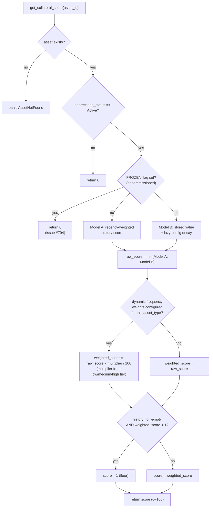

Two independent models (A and B) are computed **every time**, and the
**lower** of the two wins — either model can be the binding constraint
depending on the asset's history shape (see
[Decay Calculation Deep Dive](#decay-calculation-deep-dive) for when each
dominates).

---

## Component 1: Task Weight

Every `MaintenanceRecord`'s contribution starts from its task type's weight,
resolved by `get_task_weight`:

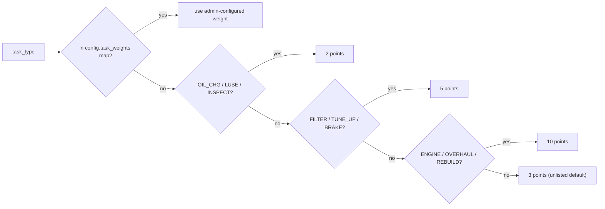

**Admin override:** `update_task_weight(admin, task_type, weight)` lets the
admin set a per-symbol weight that takes priority over the hardcoded tiers —
useful for asset types where, say, `INSPECT` should carry more weight than
the generic default.

---

## Component 2: Engineer Reputation Weighting

The task weight above is scaled by the submitting engineer's reputation
(0–1000, from `EngineerRegistry.get_reputation`) before being added to the
stored accumulator:

```
weighted_increment = task_weight × (500 + reputation) / 1000   // integer division
```

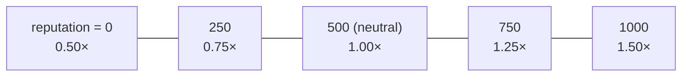

A reputation-1000 engineer's work is worth **3×** a reputation-0 engineer's
work for the same task. This is the single biggest lever an engineer's track
record has on score contribution — see
[Scenario D](#scenario-d-same-schedule-different-engineer-reputation) below.

This only affects **Model B**'s stored accumulator (`submit_maintenance`);
**Model A** (recomputed fresh from history) uses the raw `score_increment`
task weight and does not re-derive the reputation multiplier at read time —
the two models are genuinely independent, not two views of the same number.

---

## Component 3: Recency-Weighted History (Model A)

`compute_decay` (the function backing Model A, despite the name) rebuilds
the score from scratch on every call by walking the **entire** history:

```
current_ledger = current_timestamp / 5          // 1 ledger ≈ 5 seconds
for each non-duplicate record:
    age_ledgers      = current_ledger − (record.timestamp / 5)
    recency_weight   = max(0, MAX_AGE_LEDGERS − age_ledgers)
    contribution     = score_increment × recency_weight / MAX_AGE_LEDGERS
history_score = min(Σ contribution, 100)
```

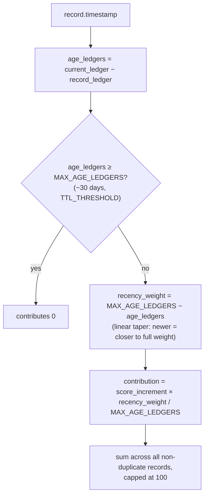

**Two details not documented elsewhere:**

- **`MAX_AGE_LEDGERS` = `shared::TTL_THRESHOLD` = 518,400 ledgers ≈ 30 days**
  — *not* 365 days. (Older documentation and some code comments describe a
  ~365-day window; the constant is actually wired to the same 30-day figure
  used for TTL extension.) This means Model A's recency taper is much
  steeper than a casual reading of the formula doc suggests: a record loses
  *all* weight in Model A after ~30 days, not ~365.
- **Duplicate-marked records are excluded.** Any record whose timestamp was
  flagged via `mark_maintenance_as_duplicate` contributes nothing to Model
  A — this prevents an engineer from inflating the score by submitting the
  same maintenance event twice. Candidates are surfaced by
  `get_duplicate_maintenance_events(asset_id, window_seconds)`, which pairs
  up same-`task_type`/same-`engineer` records submitted within
  `window_seconds` of each other for an admin to review and mark.

Because every contribution decays linearly to zero over the *same* 30-day
window regardless of the underlying `decay_interval` config, Model A acts as
a **hard ceiling** that Model B's slower, admin-tunable decay can never
exceed for records older than 30 days.

---

## Component 4: Stored Value + Lazy Decay (Model B)

Model B is a running accumulator, updated at write time and decayed at read
time:

**Write time** (`submit_maintenance` / `batch_submit_maintenance`):
```
stored_accumulator = min(stored_accumulator + weighted_increment, 100)
last_update = now
```

**Read time** (`compute_read_only_collateral_score`, or `apply_decay` in the
write-capable variants):
```
elapsed         = now − last_update
decay_intervals = floor(elapsed / decay_interval)     // default: 30-day intervals
config_score    = max(0, stored_accumulator − decay_intervals × decay_rate)
```

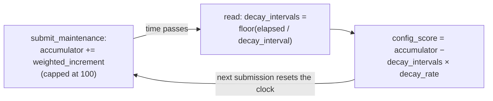

Unlike Model A's fixed 30-day taper, Model B's `decay_rate` and
`decay_interval` are **admin-configurable** (`update_decay_config`) — an
operator could, for example, make decay much more aggressive for
high-criticality asset types.

---

## Component 5: Dynamic Frequency Weight

An optional, per-asset-type multiplier applied **on top of** `min(Model A,
Model B)`, configured via `update_scoring_weights(admin, asset_type,
weights_json)`. This component is not mentioned in either of the other two
scoring docs.

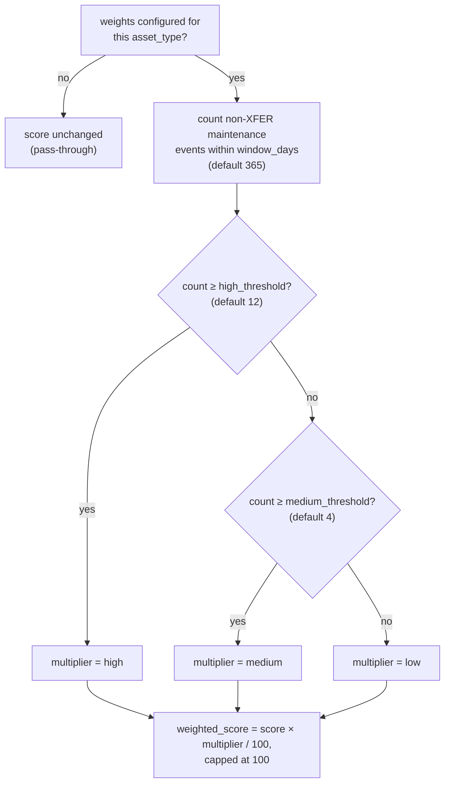

`weights_json` is a small JSON object: `{"low": 90, "medium": 100, "high":
120, "medium_threshold": 4, "high_threshold": 12, "window_days": 365}` —
values are percentages (`120` ⇒ 1.2×). If the JSON is malformed or any of
`low`/`medium`/`high`/`window_days` is `0`, or `high_threshold <
medium_threshold`, `update_scoring_weights` panics with `InvalidConfig` and
the previous configuration (if any) is left untouched.

**Use case:** reward assets with a consistently high maintenance cadence
(e.g. a `high` multiplier of `120` for assets serviced 12+ times/year) or
penalize infrequently-serviced asset types (a `low` multiplier of `90`) —
without changing the underlying task weights or decay parameters that apply
uniformly to every asset type.

---

## Combining the Models, Floor, Cap, and min()

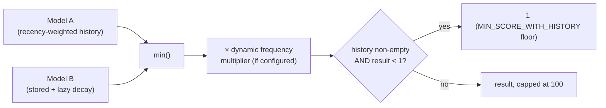

- **Cap:** both models individually cap at 100 before combination, and the
  frequency-weighted result is capped at 100 again afterward — a score can
  never exceed 100 no matter how it's composed.
- **Floor:** the floor is checked against maintenance **history**
  (`get_maintenance_history`), not score **history** (`get_score_history`) —
  an asset with one very old, fully-decayed record still floors at `1`, not
  `0`. This is what distinguishes "maintained, but decayed" (`1`) from
  "never maintained" (`0`).

---

## The Three Query Functions Are Not Identical

This is the most consequential subtlety in the whole scoring system for
integrators, and it isn't spelled out elsewhere:

| Function | Storage side effect | Frozen-asset return value | Dynamic frequency weight (Component 5) applied? |
|---|---|---|---|
| `get_collateral_score(asset_id)` | **None.** Uses `compute_read_only_collateral_score`, which only reads. | `0` | **Yes** |
| `get_collateral_score_opt(asset_id)` | **Lazy write** if a full `decay_interval` has elapsed since `last_update` (via `apply_decay(..., emit_event=false, ...)`) | The actual stored `FRZ_SCR` value, **not** `0` | **No** |
| `get_collateral_score_batch(asset_ids)` | Same lazy write as `_opt`, per asset | `0` (matches the plain function, not `_opt`) | **No** |

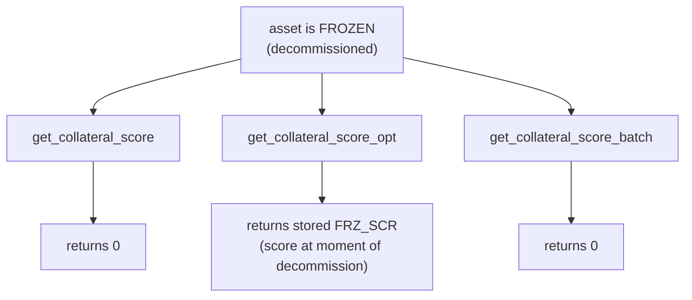

**Practical implication (frozen assets):** if a lending integration wants
"is this asset valid collateral right now" it should call the plain
`get_collateral_score` — it is the one guaranteed to return `0` for any
decommissioned asset per issue #794, and it never has a surprise write side
effect. If an auditor or risk-analytics tool wants "what score did this
asset have when it was decommissioned" for historical reporting,
`get_collateral_score_opt` is the one that preserves that value.

**Practical implication (dynamic frequency weight):** `apply_dynamic_frequency_weight`
(Component 5) is only ever called from `compute_read_only_collateral_score`
— it does not exist anywhere in `apply_decay`, the function backing `_opt`,
`_batch`, and `decay_score`. If an asset type has dynamic frequency weights
configured, **`get_collateral_score` and `get_collateral_score_batch` can
disagree on a live (non-frozen) asset's score**, even accounting for the
lazy-write timing difference — not just on frozen assets. Any integration
that cross-checks scores between the single-asset and batch endpoints
should be aware the batch endpoint ignores this component entirely.

---

## Decay Calculation Deep Dive

### Why "lazy"?

Neither model runs on a schedule. Nothing decays until *something* reads (or
writes through) the score. Two consequences:

1. An asset with no queries for a year has a stored `SCORE` that still
   reflects its last computed value — but the **next** read recomputes decay
   for the full elapsed period in one step, it does not need to have been
   read every interval along the way.
2. `submit_maintenance` itself does not explicitly call the decay routine
   before adding the new increment — it directly does
   `min(stored_accumulator + weighted_increment, 100)`. Decay against the
   *stored accumulator* only happens through a read path (`decay_score`,
   `get_collateral_score_opt`, `get_collateral_score_batch`) or is
   reconstructed fresh by Model A. In practice this rarely matters because
   Model A independently re-derives a decayed-by-recency number every time,
   and `min()` keeps whichever model is currently lower — but it means the
   stored `SCORE` value alone, read without going through one of the decay
   paths, can be a stale, undecayed number.

### Interval math is whole-interval, not proportional

```
decay_intervals = floor(elapsed / decay_interval)
```

A gap of 29 days contributes **zero** decay under Model B's default 30-day
interval; a gap of 31 days contributes a full interval's worth (`decay_rate`
points), even though only 1 extra day passed beyond the threshold. Decay is
a **step function**, not a smooth ramp:

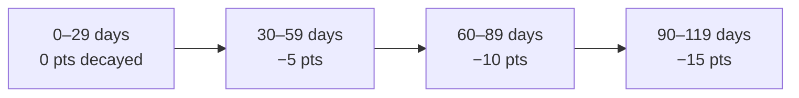

### When does each model dominate?

| Situation | Binding model | Why |
|---|---|---|
| Frequent maintenance (gaps ≪ 30 days) | Model B | Model A's contributions barely taper before the next event refreshes them; Model B's accumulator, built from reputation-weighted increments, is usually the smaller number early on. |
| One old record, no recent activity, `decay_rate`/`decay_interval` configured generously (slow decay) | Model A | Model A hits zero for that record at exactly 30 days regardless of admin config; Model B can be configured to decay much more slowly, letting Model A become the binding (lower) constraint. |
| One old record, aggressive admin decay config (fast decay) | Model B | If the admin sets `decay_rate` high / `decay_interval` short, Model B can fall below Model A's ~30-day floor sooner. |
| Asset with a long history, most of it older than 30 days | Model A | Only records within the trailing ~30 days contribute *anything* to Model A — older records (even if still stored, up to `max_history`) are structurally invisible to it, capping how high Model A alone could ever push the score. |

This is why the contract computes **both** rather than picking one: Model A
guards against a stale, over-generous stored accumulator (e.g. after an
admin loosens `decay_rate`); Model B guards against a single old high-weight
task keeping Model A artificially elevated forever if the recency window
were the only signal.

---

## Worked Examples by Asset Scenario

Each scenario uses `score_increment = 5`, `decay_rate = 5`, `decay_interval
= 30 days`, `MAX_AGE_LEDGERS ≈ 30 days`, engineer reputation `500` (neutral)
unless stated otherwise, and no dynamic frequency weights configured unless
stated.

### Scenario A: Diligently Maintained Generator — a Model A Surprise

`INSPECT` (2 pts) every 10 days, indefinitely. It's tempting to assume this
climbs forever like Model B's accumulator does (2, 4, 6, 8, …, capped at
100) — but Model A never lets it, and **Model A is the one that binds**:

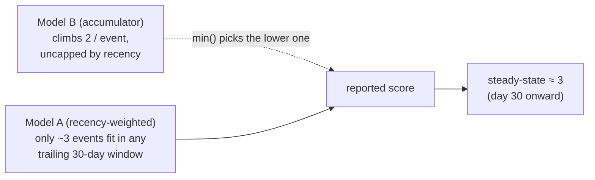

Once the schedule reaches steady state (day 30+), any 30-day window holds
exactly 3 records (ages 0, 10, 20 days — the one at 30 days has just aged
out):

```
contribution(age=0)  = 2 × (30−0)/30  = 2
contribution(age=10) = 2 × (30−10)/30 ≈ 1
contribution(age=20) = 2 × (30−20)/30 ≈ 0
Model A ≈ 3
```

`min(Model A ≈ 3, Model B → 100) = 3`. **The reported score plateaus around
3, indefinitely** — nowhere near the default eligibility threshold of 50 —
no matter how many years this cadence continues. This is a direct,
non-obvious consequence of Model A's fixed 30-day window: low-weight tasks
(2 pts) can *never* push the reported score anywhere close to eligibility on
their own, regardless of frequency (even daily 2-point submissions only
reach a Model A steady-state of ≈30 — see the math in
[Component 3](#component-3-recency-weighted-history-model-a)). Reaching
eligibility requires enough 5- or 10-point tasks within any rolling 30-day
window, not just frequent minor ones.

### Scenario B: Neglected Wind Turbine

One `OVERHAUL` (10 pts) at day 0, then nothing for a year.

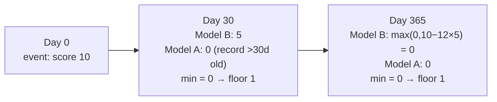

By day 30, Model A has already fallen to `0` (the single record is now
older than `MAX_AGE_LEDGERS`), while Model B has only decayed one interval
to `5`. `min(0, 5) = 0`, then the history-floor kicks in → reported score
`1`. The asset sits at the floor of `1` indefinitely — distinguishable from
an unmaintained asset (`0`), but far below the eligibility threshold.

### Scenario C: New Asset, Rapid Build-Up

A newly registered asset gets a `REBUILD` (10 pts) followed by three
`FILTER` (5 pts) events, one every 5 days. Because the asset is brand new,
*every* record submitted so far is still within Model A's 30-day window —
none have aged out yet — but they are still individually tapered by age, so
Model A is lower than Model B's simple running sum even here:

```
Model B (day 15) = 10 + 5 + 5 + 5 = 25   // no decay: all gaps ≪ 30 days

Model A (day 15), per record:
  REBUILD (age 15d): 10 × (30−15)/30 = 5
  FILTER  (age 10d):  5 × (30−10)/30 ≈ 3
  FILTER  (age 5d):   5 × (30−5)/30  ≈ 4
  FILTER  (age 0d):   5 × (30−0)/30  = 5
  Model A ≈ 17

reported score = min(17, 25) = 17
```

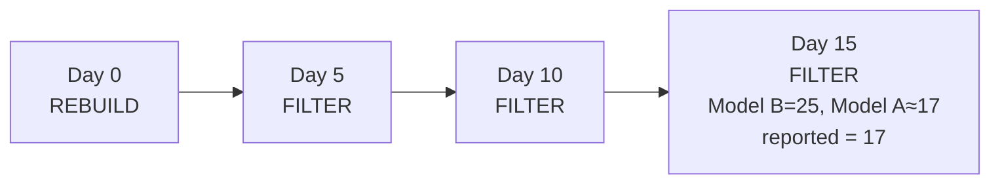

Model A is the binding constraint even for a fresh asset with no aged-out
records — every individual record is still discounted by its own age. As
the same records keep aging (with no further submissions), Model A will
keep falling toward 0 over the next 15 days while Model B holds steady at
25, exactly like [Scenario B](#scenario-b-neglected-wind-turbine). Sustained
eligibility requires *continued* submissions to keep refreshing Model A, not
just an initial burst.

### Scenario D: Same Schedule, Different Engineer Reputation

Both assets get one `ENGINE` (10 pts) task, current *Model B accumulator*
30, no decay accrued — but performed by engineers with different
reputations. (Isolating Model B here for clarity: the reputation multiplier
only affects Model B's write-time accumulator, per
[Component 2](#component-2-engineer-reputation-weighting) — the final
reported score would still be `min()`-ed against Model A as in every other
scenario.)

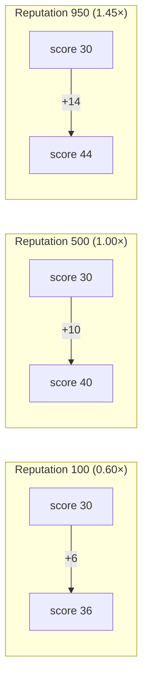

Identical work, up to **8 points** apart in outcome purely from
`weighted_increment = 10 × (500 + reputation) / 1000`. This is the
mechanism by which the system economically incentivizes engineers to build
and protect their reputation.

### Scenario E: Dynamic Frequency Weight in Effect

Asset type `GENSET` configured with `{"low": 85, "medium": 100, "high":
115, "medium_threshold": 4, "high_threshold": 10, "window_days": 90}`.
Two otherwise-identical assets both reach `min(Model A, Model B) = 40`:

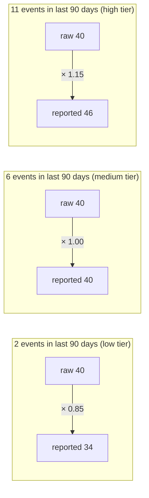

Same underlying task history "value," but the *cadence* of maintenance
shifts the final reported score by ±15% — this is the lever admins have to
reward consistent servicing independent of task-type weighting.

### Scenario F: Decommissioned Mid-Loan

An asset with a stored score of 62 gets decommissioned. `decommission_notify`
computes `frozen_score = compute_decay(asset_id)` (Model A only, at that
instant — say it evaluates to `58`) and sets `FRZ_SCR = 58`, `FROZEN =
true`.

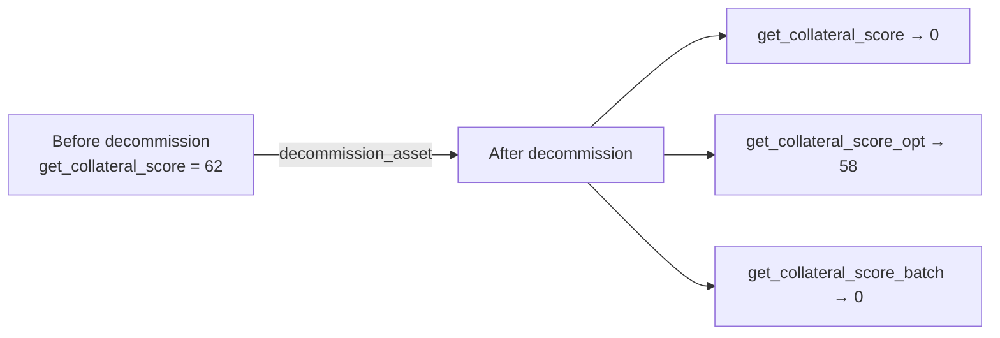

A lender's automated eligibility check (using the plain function) correctly
and immediately sees `0` — this asset can no longer be used to open new
loans. An after-the-fact audit tool (using `_opt`) can still recover `58` to
understand what the collateral was "worth" right before decommissioning,
e.g. to reconcile an already-issued loan's risk exposure at the time it was
extended.

---

## Configuration Reference

| Parameter | Default | Configurable via | Affects |
|---|---|---|---|
| `score_increment` | 5 | `update_score_increment` | Base points per event (Model B write path; also `get_task_weight`'s fallback tiers are hardcoded, not this value, unless overridden per-type) |
| `decay_rate` | 5 | `update_decay_config` | Points removed per elapsed interval (Model B) |
| `decay_interval` | 2,592,000s (30 days) | `update_decay_config` | Length of one decay interval (Model B) |
| `MAX_AGE_LEDGERS` (`shared::TTL_THRESHOLD`) | 518,400 ledgers (~30 days) | not configurable | Recency taper window (Model A) |
| `max_history` | 200 | `update_max_history` | How many records Model A ever sees; older records are pruned out entirely |
| `eligibility_threshold` | 50 | `update_eligibility_threshold` / `set_eligibility_threshold` | Not used by `get_collateral_score` itself; checked by the separate `is_collateral_eligible(asset_id)` / `batch_is_collateral_eligible(asset_ids)` view functions — see caveat below |
| per-`task_type` weight | (tiered defaults) | `update_task_weight` | Component 1 |
| per-`asset_type` frequency weights | none (pass-through) | `update_scoring_weights` | Component 5 |

> **Caveat — `is_collateral_eligible` does not check the same score as
> `get_collateral_score`.** As currently implemented, `is_collateral_eligible`
> compares **Model A alone** (`compute_decay`'s raw recency-weighted sum)
> against `eligibility_threshold` — not `min(Model A, Model B)`, and without
> applying the floor or the dynamic frequency weight multiplier. In the vast
> majority of cases Model A is the lower/binding model anyway (see [When does
> each model dominate?](#when-does-each-model-dominate)), so this rarely
> changes the boolean outcome — but an integrator who assumes
> `is_collateral_eligible(id) == (get_collateral_score(id) >=
> eligibility_threshold)` should be aware these are not, byte-for-byte, the
> same computation.

---

## Further Reading

- [collateral-scoring-formula.md](collateral-scoring-formula.md) — precise formula reference and additional worked examples
- [collateral-scoring.md](collateral-scoring.md) — narrative overview, score floor rationale
- [contract-interaction-sequences.md](contract-interaction-sequences.md) — where scoring fits into the full cross-contract call flow
- [ttl-strategy.md](ttl-strategy.md) — the TTL constant that also backs `MAX_AGE_LEDGERS`
